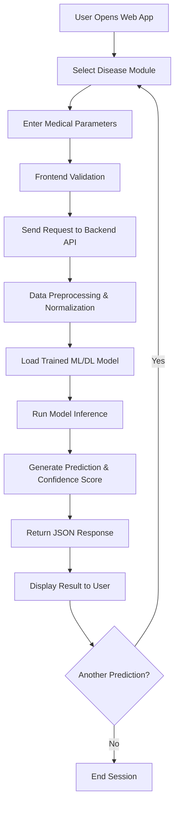

# 🏥 AI Healthcare Disease Prediction System

A modular, AI-powered healthcare prediction platform designed to assist in **early disease risk assessment** using globally recognized machine learning and deep learning algorithms. The system follows production-grade design principles aligned with real-world healthcare AI deployments.

---

## 📌 Model Artifacts & Data Availability

Due to GitHub storage and bandwidth limitations, **trained model artifacts and large-scale datasets are not included** in this repository.

* Models were trained on **very large medical datasets (100GB+)**
* Uploading trained artifacts to GitHub is not feasible
* This repository focuses on **architecture, inference logic, APIs, and deployment configuration**

> In enterprise and research environments, trained models are stored in secure object storage (AWS S3, GCP, Azure) or private registries — not in source control.

---

## 🧠 Famous Algorithms Used (Industry-Recognized)

The following **world-famous and research-proven algorithms** were used during training and evaluation:

1. **Logistic Regression**
   Widely used baseline algorithm for interpretable medical risk prediction.

2. **Random Forest**
   A powerful ensemble learning method extensively adopted in healthcare for robustness and feature importance analysis.

3. **Support Vector Machine (SVM)**
   Effective for high-dimensional medical datasets with strong generalization ability.

4. **Convolutional Neural Networks (CNN)**
   State-of-the-art deep learning architecture for medical image-based disease detection (brain & lung analysis).

5. **Artificial Neural Networks (ANN)**
   Used to model complex non-linear relationships in structured patient health data.

6. **Transformer Architecture**
   A breakthrough model for learning long-range dependencies in complex medical representations.

7. **BERT / BioBERT / ClinicalBERT**
   Transformer-based models used for contextual understanding of clinical and biomedical data.

8. **Autoencoders (Encoder–Decoder Models)**
   Applied for feature compression, anomaly detection, and dimensionality reduction in large medical datasets.

> These algorithms are extensively referenced in **IEEE, Nature, Elsevier, and PubMed-indexed research** and form the backbone of modern healthcare AI systems.

---

## 🏗️ Project Structure

```
AI_health_care/
├── assets/                 # Static frontend assets (images, styles)
├── brain/                  # Brain disease ML module
│   └── artifacts/          # (Excluded) Trained brain models
├── lung/                   # Lung disease ML module
│   └── artifacts/          # (Excluded) Trained lung models
├── server/                 # Python backend (API / inference engine)
├── index.html              # Landing page
├── brain.html              # Brain disease prediction UI
├── heart.html              # Heart disease prediction UI
├── lung.html               # Lung disease prediction UI
├── render.yaml             # Deployment configuration
├── runtime.txt             # Python runtime version
├── .python-version         # Local Python version
├── .gitignore              # Git ignore rules
├── .gitattributes          # Git attributes
└── LICENSE                 # Apache 2.0 License
```

---

## 🔄 System Workflow (End-to-End)



---

## 🚀 Deployment & Scalability

* Designed for cloud deployment (Render-compatible)
* Python runtime version pinned for consistency
* ML models can be integrated via secure external storage
* Modular architecture enables easy extension to new diseases

---

## ✅ Why This Project Is Industry-Relevant

* Uses **globally accepted ML & DL algorithms**
* Demonstrates **real-world healthcare AI architecture**
* Handles large-scale data responsibly
* Follows production-grade deployment practices
* Suitable for academic, research, and enterprise evaluation

---

## 📜 License

Licensed under the **Apache License 2.0** — free for academic, research, and commercial use.
